# Runtime e acquisizione del roster

## Decisione

Il roster personale viene acquisito dalla UI ufficiale del gioco, con una
pipeline supervisionata e provenance-aware. La sorgente primaria è il client
Windows nativo già in uso; BlueStacks rimane un adapter secondario. La vecchia
VM VirtualBox è conservata come evidenza storica e non viene avviata
automaticamente.

Questa scelta deriva dai rilievi del 14 luglio 2026:

| Runtime | Stato | Posizione | Strategia |
| --- | --- | --- | --- |
| Client Windows Doomsday | versione osservata 1.58.0 il 23/07/2026; verificare il runtime attivo | risolto dal profilo workstation, dal registry Windows o dal collegamento configurato | cattura Win32 visibile, OCR, conferma |
| BlueStacks | opzionale; installazione da rilevare su ogni workstation | directory da registry o profilo locale | ADB screencap solo se un'istanza è già attiva |
| VirtualBox Android-x86 | inventario storico, spento dal 2025-01-07 | directory da rilevare su ogni workstation | inventario; nessun avvio automatico |

Il registro machine-readable corrente è locale a
`workstation/local/<profile>/runtime/doomsday/game_runtime_registry.json` e
non viene sincronizzato su Git.

## Perché non leggiamo direttamente i file del gioco

Le cartelle `LocalLow/IGG` contengono log, bundle, cache e storage locale, ma il
sopralluogo non ha trovato i nomi noti del roster in chiaro nei cache candidati.
Il roster è quindi verosimilmente server-authoritative o serializzato in un
formato interno non stabile. Questa è un'inferenza, non una prova del formato.

I file locali possono aiutare a riconoscere versione, catalogo e stato tecnico;
non sono considerati la fonte canonica della proprietà, del livello o delle
abilità dei nostri eroi.

Non fanno parte dell'architettura:

- lettura o modifica della memoria del processo;
- intercettazione o decifratura del traffico di rete;
- estrazione di cookie, token o identificativi account;
- accesso root a `/data/data` dell'emulatore;
- avvio nascosto di VM, emulatori o daemon ADB.

## Flusso dati

```mermaid
flowchart LR
    A["Runtime registry"] --> B["Capture provider"]
    B --> C["PNG locale temporaneo"]
    C --> D["OCR e parser per schermata"]
    D --> E["RosterObservation"]
    E --> F["ProviderContribution atomiche"]
    F --> G["EvidenceResolver"]
    G --> H["Anteprima differenze"]
    H --> I["Conferma utente"]
    I --> J["Roster personale persistente"]
```



Ogni valore letto conserva runtime, versione del gioco, timestamp, metodo di
cattura, file sorgente e confidenza. Valori manuali o provenienti da altre fonti
non vengono sovrascritti: le alternative restano disponibili al resolver.

## Sequenza di acquisizione

Per ciascun eroe la sequenza proposta è:

1. griglia `Eroe`, per nomi e possesso;
2. overview, per livello, stelle, rarità e tipo squadra;
3. statistiche, per ATK, DEF, HP, SPD e valori disponibili;
4. abilità, per livelli e descrizioni;
5. talenti, quando serve ricostruire il ruolo.

Il primo adapter implementato cattura la finestra già aperta con BitBlt. È stato
verificato sul client corrente con un frame 3440×1440 non nero; i file di prova
restano sotto `.tools/`, esclusa da Git.

L'OCR esistente è collegato al contratto `RosterObservation`. I valori di
default non osservati vengono eliminati prima della pubblicazione, evitando che
un OCR incompleto registri falsi zero.

## Confine tra osservazione e controllo

La fase attuale è intenzionalmente read-only:

- il probe individua runtime e processi ma non li avvia;
- il capture provider fotografa una finestra già visibile;
- il servizio non clicca e non scorre la UI;
- la persistenza definitiva del roster richiederà un'anteprima e una conferma.

La navigazione automatica verrà aggiunta solo dopo avere riconoscitori affidabili
per `Eroe`, profilo, statistiche, abilità e talenti. Le azioni useranno nodi
semantici del grafo UI e il policy gate, non coordinate assolute isolate.

## BlueStacks

Le istanze osservate sono `Nougat64`, `Pie64` e `Pie64_2`; root è disabilitato.
Il futuro adapter BlueStacks dovrà:

1. verificare che `HD-Player.exe --instance ...` sia già attivo;
2. verificare la porta dell'istanza senza eseguire una scansione invasiva;
3. usare `adb exec-out screencap -p` per la cattura;
4. permettere `input tap/swipe` solo in sessione supervisionata e policy-gated;
5. non tentare accessi al data directory privato dell'app.

`adb devices` non viene chiamato dal probe, perché può avviare il daemon ADB.

## Strumenti operativi

Inventario read-only:

```powershell
$env:PYTHONPATH = (Get-Location).Path
python scripts/probe_game_runtimes.py
```

Aggiornamento esplicito del registro:

```powershell
python scripts/probe_game_runtimes.py --write
```

Cattura della finestra già aperta:

```powershell
python scripts/capture_roster_frame.py
```

## Stato e prossime tranche

Implementato:

- registro persistente dei tre runtime;
- probe read-only senza ADB;
- cattura Win32 compatibile con il client DirectX visibile;
- contratto per sessioni, osservazioni e contributi atomici;
- adapter OCR statistiche/talenti;
- normalizzazione di separatori OCR come `ATK: 1234`.

Da completare con campioni reali delle schermate `Eroe`:

- rilevatore della griglia e segmentazione delle carte eroe;
- crop versionati per overview, statistiche, abilità e talenti;
- OCR italiano calibrato su font e risoluzione del gioco;
- anteprima differenze e commit confermato nel repository roster;
- adapter ADB opzionale per BlueStacks già attivo.
